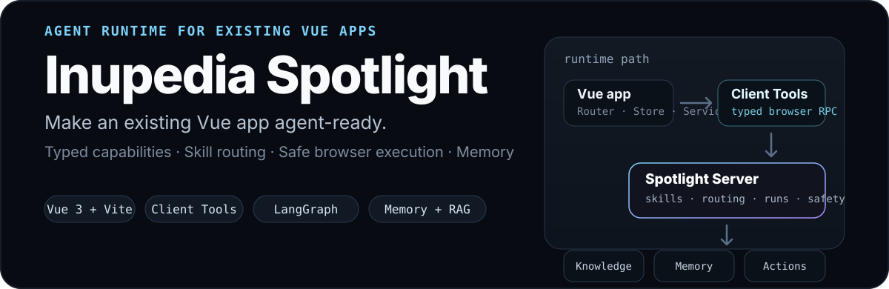

<p align="center">
  
</p>

<p align="center">
  <a href="./skills/spotlight-integrate/README.md"><strong>Agent Skill 接入</strong></a>
  ·
  <a href="./docs/client-tools.md">Client Tools</a>
  ·
  <a href="./docs/server-deployment.md">Server 部署</a>
  ·
  <a href="./packages/README.md">Packages</a>
</p>

## Spotlight 是什么

**Inupedia Spotlight** 是一套面向现有 **Vue 3 + Vite** 应用的 Agent Runtime。业务前端只声明“当前页面真正能做什么”，Spotlight 把这些能力变成带类型的 **Client Tools**，再通过 **Skills**、LangGraph 路由、Knowledge、Memory 和可恢复 Run，把自然语言安全地落到已有业务能力上。

> **宿主业务代码始终是事实源。** Spotlight 不复制一套业务系统，也不依赖 CSS Selector 模拟点击；Router、Store、Service、GIS、播放器、Pinia 等能力仍留在原应用中。

### 一条真实的调用链

```text
用户自然语言
    ↓
Skill 选择 / LangGraph 路由
    ↓
Spotlight Server
    ↓
Client Tool（类型 + JSDoc + JSON Schema）
    ↓
浏览器 RPC
    ↓
原 Router / Store / Service / 页面引擎
```

你写的是业务适配层，Spotlight 负责把它变成可路由、可恢复、可记忆的 Agent 能力：

| 业务项目负责 | Spotlight SDK / Server 负责 |
| --- | --- |
| 包装已有 Router / Store / Service 为 Client Tool | 构建期推导 Tool 名、JSDoc 与 JSON Schema |
| 编写业务 Skill，说明何时使用哪些 Tool | Skill 路由、Knowledge、Action 与多步编排 |
| 提供 `projectId`、Server URL、稳定用户 ID | 会话状态、长期记忆、Run 生命周期与 SSE 恢复 |
| 保留原有权限、状态和业务约束 | 在 Runtime 中按能力等级决定是否允许派发 / 重放 |

## 为什么不是 DOM Agent

Spotlight 推荐：

```text
自然语言 → Skill → Client Tool → 原 Store / Service / Router
```

而不是：

```text
自然语言 → CSS Selector → 模拟鼠标点击
```

这样做有三个直接收益：

- **可维护**：页面改布局、换组件，不会让 Agent 的核心能力一起失效。
- **可验证**：Tool 输入输出来自 TypeScript 类型，构建阶段就能发现缺失描述和不可推导类型。
- **可控**：读、查询、导航和外部写入可以采用不同的执行与恢复策略，而不是把所有操作都当成“点一下”。

## 最快接入：让 Coding Agent 蒸馏现有前端

新项目优先使用仓库自带的 [`spotlight-integrate`](./skills/spotlight-integrate/README.md) Skill Pack。它会先分析真实 Router / Store / Service / UI 能力，再生成 Client Tools、业务 Skills、Project Pack 和验收材料。

把整个目录复制到 Cursor / Codex / Claude Code 的 skills 目录：

```text
skills/spotlight-integrate/
```

然后在**已经打开宿主 Vue 项目**的 Coding Agent 中执行：

```text
Use spotlight-integrate.
Agentize this app with Spotlight.
Follow architecture.md and standard.md.
```

也可以直接把完整 Skill Pack 展开到剪贴板：

```bash
bash skills/spotlight-integrate/prompt.sh --copy
```

接入过程中，人只需要确认少量项目级信息，例如 `projectId`、Spotlight Server 地址 / API key，以及用于 Memory 的稳定登录用户 ID。

> 当前自动接线路径以 **Vue 3 + Vite** 为目标。非 Vue 3 项目不会被强行改造成 Vue，也不会擅自迁移构建系统。

## 手工接入

如果你更希望自己控制 Tool 和 Skill，最小路径也很薄。

### 1. 安装

```bash
pnpm add @inupedia/spotlight-client @inupedia/spotlight-vue
```

### 2. 把已有业务函数包装成 Client Tool

```ts
// src/spotlight/tools.ts
import { defineClientTool } from "@inupedia/spotlight-client";
import { videoService } from "@/service/video";

/** 按名称全屏播放指定视频。 */
export const playVideoFullscreen = defineClientTool(
  async ({ name }: { name: string }): Promise<void> => {
    await videoService.playFullscreen(name);
  },
);

export const spotlightTools = [playVideoFullscreen];
```

Spotlight 在构建阶段从**导出变量名 + JSDoc + TypeScript 类型**推导 Tool 名称、说明和 JSON Schema；业务代码不需要手写 LangChain Tool 元数据。

### 3. 注册 Spotlight

```ts
// src/main.ts
import { createApp } from "vue";
import { SpotlightVue } from "@inupedia/spotlight-vue";
import App from "./App.vue";
import spotlightConfig from "./spotlight/config";

createApp(App)
  .use(SpotlightVue, { config: spotlightConfig })
  .mount("#app");
```

完整的 Vite 插件、配置、Skill 加载与环境变量示例见 **[Client Tool / Skill 接入指南](./docs/client-tools.md)**。

## Runtime 里发生了什么

Spotlight 把“浏览器里真实存在的能力”和“服务端 Agent Runtime”明确分开：

```text
┌──────────────────────────────┐        ┌────────────────────────────────┐
│         Vue Host App         │        │        Spotlight Server        │
│                              │        │                                │
│ Router / Store / Service     │        │ LangGraph routing              │
│          ↓                   │  RPC   │ Skills / Knowledge / Actions   │
│ Client Tools ────────────────┼───────→│ Run state / SSE                │
│          ↑                   │←───────┼ Long-term Memory Gate          │
│ fresh uiContext after action │        │ Provider integrations          │
└──────────────────────────────┘        └────────────────────────────────┘
```

浏览器负责执行真实页面能力；Server 负责理解、规划、检索、记忆和运行状态。通用 Server 不应该写死某个产品的业务语义，具体业务知识保留在宿主 Skill、Tool description、schema 和 `uiContext` 中。

## Capability tiers

每个 Client Tool 有且只有一个能力等级，Runtime 据此决定是否允许安全重放：

| Tier | 典型行为 | 断线 / 丢结果后 |
| --- | --- | --- |
| `observe` | 读取浏览器或 UI 状态 | 可直接重发 |
| `query` | 读取业务后端，幂等 | 可直接重发 |
| `navigate` | 改变 UI，本地可逆 | 可直接重发 |
| `mutate` | 修改外部系统 | **不能盲目重发** |

不显式填写 `tier` 时，可由 `sideEffect`、`replayPolicy`、`riskLevel` 推导。更完整的协议设计见 [`capability-protocol-v2.md`](./docs/design/capability-protocol-v2.md)。

## Run 与连接分离

Spotlight 的 Run 不绑定某一次 SSE 连接：

- 每个事件带 `seq`，重连可通过 `Last-Event-ID`（或 `?lastEventId=`）增量续读，而不是重新执行整轮。
- 浏览器断开时，Run 可以进入 `waiting_for_host`；Host 恢复后继续处理未完成的页面调用。
- 过期 Run 返回 `410`，客户端据此停止无意义重试。
- 浏览器每次执行 Tool 后回传新的 `uiContext`，Agent 下一步看到的是**操作之后**的页面状态。

## Memory

Spotlight 将两类记忆分开：

- **会话记忆**：由 LangGraph Checkpointer 按 `projectId + sessionId` 保存。
- **跨会话长期记忆**：必须由宿主提供稳定的 `memorySubjectId`。

如果宿主没有稳定用户 ID，Spotlight 会拒绝把“记住这个”降级成项目级共享记忆，避免不同用户之间发生记忆串扰。

## Packages

| Package | 职责 |
| --- | --- |
| `@inupedia/spotlight-protocol` | Client / Server 共享协议 |
| `@inupedia/spotlight-client` | `defineClientTool`、HTTP、Vite Tool Manifest |
| `@inupedia/spotlight-vue` | Vue Plugin、命令面板、Skill 上报与浏览器执行管线 |
| `@inupedia/spotlight-memory` | Memory Gate 与缓存存储 |
| `@inupedia/spotlight-server` | 可部署的 LangChain / LangGraph Runtime |

更完整的 package 说明见 [`packages/README.md`](./packages/README.md)。

## 版本与兼容性

当前发布版本以 npm registry 为准：

```bash
npm view @inupedia/spotlight-vue version
npm view @inupedia/spotlight-server version
```

`@inupedia/spotlight-*` 与 `ghcr.io/inupedia/spotlight-server:<version>` 应保持同一 semver。仓库本身要求 **Node.js >= 22**、**pnpm >= 9**；当前 Vue package 的 peer 目标为 **Vue >= 3.5** 与 **Pinia >= 3**。

## 开发

```bash
pnpm install
pnpm test
pnpm build
```

常用校验：

```bash
pnpm typecheck
pnpm smoke:packages
pnpm test:ci
```

发布流程以 tag 驱动。CI 对齐 workspace package 版本、运行测试并发布 npm；Server 镜像发布到：

```text
ghcr.io/inupedia/spotlight-server:<version>
```

Node-only 能力必须走 `/node` 子入口，不能混入浏览器主包。

## 继续阅读

| 想做什么 | 文档 |
| --- | --- |
| 让 Coding Agent 自动完成现有 Vue 项目的 Agent 化 | [`skills/spotlight-integrate/README.md`](./skills/spotlight-integrate/README.md) |
| 手工定义 Client Tool / Skill | [`docs/client-tools.md`](./docs/client-tools.md) |
| 部署 Spotlight Server / Project Pack | [`docs/server-deployment.md`](./docs/server-deployment.md) |
| 理解 Capability / 重放协议 | [`docs/design/capability-protocol-v2.md`](./docs/design/capability-protocol-v2.md) |
| 查看 SDK 包结构 | [`packages/README.md`](./packages/README.md) |

---

<p align="center">
  <sub>Build the agent layer around the product you already have — not a second product beside it.</sub>
</p>
