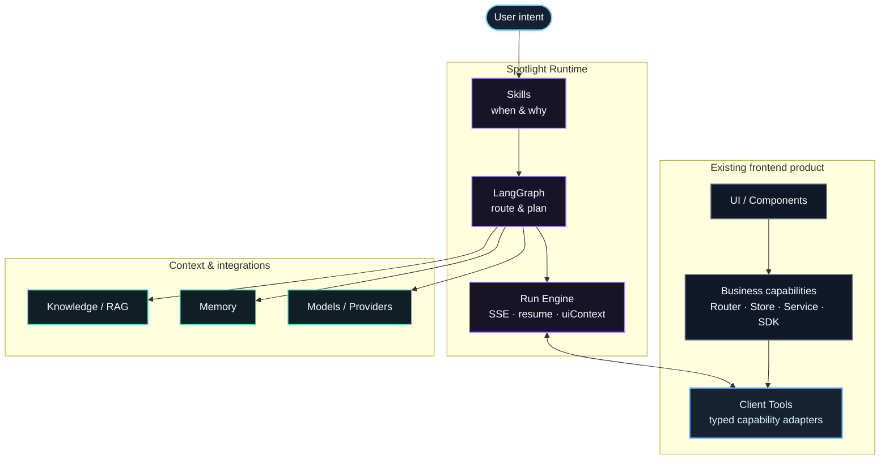
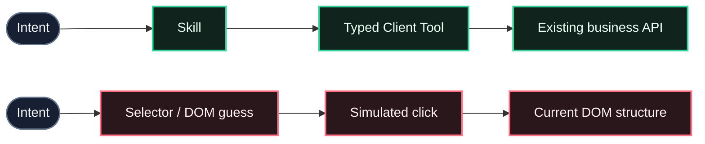
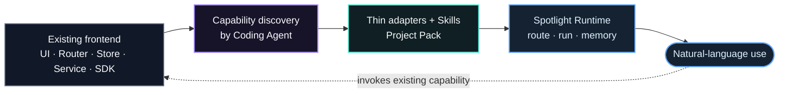
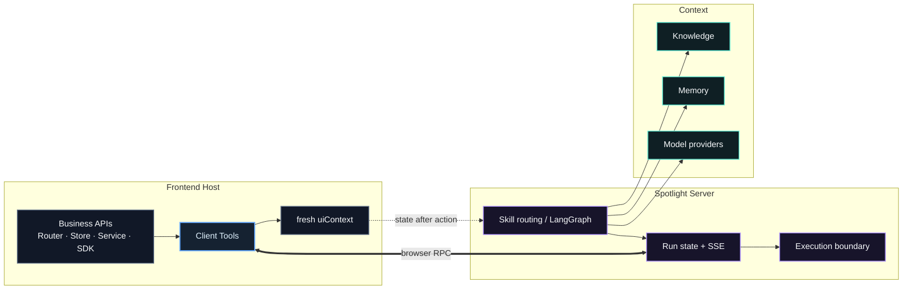

<p align="center">
  
</p>

<p align="center">
  <a href="./skills/spotlight-integrate/README.md"><strong>Agent Skill 接入</strong></a>
  ·
  <a href="./docs/client-tools.md">Client Tools</a>
  ·
  <a href="./docs/server-deployment.md">Server 部署</a>
  ·
  <a href="./packages/README.md">Packages</a>
</p>

## Spotlight 是什么

**Inupedia Spotlight** 是一套面向现有**前端产品**的 Agent Runtime。它不要求重做 UI，也不在宿主旁边复制一套“Agent 版业务系统”；而是把前端中真实存在的业务能力包装成带类型的 **Client Tools**，再通过 **Skills**、LangGraph、Knowledge、Memory 和可恢复 Run，把自然语言安全地落到原有产品能力上。

> **核心架构不绑定前端框架。** Router、Store、Service、SDK、GIS、播放器或其它业务入口仍由宿主产品掌握。Spotlight 负责能力协议、路由、运行状态、知识与记忆。当前仓库首先提供 **Vue 3 + Vite** 的完整 Adapter 与自动化接入路径，后续框架可以沿同一 Client Tool / Skill 模型扩展。

### 整体架构



这张图里，**宿主产品始终是业务事实源**。Spotlight 不依赖 CSS Selector 模拟点击，也不要求业务逻辑迁入 Server；它只在“自然语言意图”和“已有业务能力”之间增加一层可描述、可路由、可恢复的 Agent Runtime。

| 业务项目负责 | Spotlight SDK / Server 负责 |
| --- | --- |
| 暴露稳定的 Router / Store / Service / SDK 能力 | 将能力组织为 Client Tool 协议与运行时调用 |
| 编写业务 Skill，说明何时使用哪些 Tool | Skill 路由、Knowledge、Action 与多步编排 |
| 提供 `projectId`、Server URL、稳定用户 ID | 会话状态、长期记忆、Run 生命周期与 SSE 恢复 |
| 保留原有权限、状态和业务约束 | 维护 Run 状态、连接恢复与服务端执行边界 |

## 为什么不是 DOM Agent



**Spotlight 走的是 capability path，而不是 pixel / selector path。** 这样做有三个直接收益：

- **可维护**：页面改布局、换组件，不会让 Agent 的核心能力一起失效。
- **可验证**：Tool 有明确名称、描述和输入输出契约；当前 TypeScript Adapter 还能在构建期推导 JSON Schema。
- **可控**：读取、查询、导航和外部写入可以采用不同的执行与恢复策略，而不是把所有操作都简化成“点一下”。

## 最快接入：让 Coding Agent 蒸馏现有前端

Spotlight 的目标接入方式是：让 Coding Agent 先理解宿主产品真正拥有的能力，再生成薄 Adapter、业务 Skills 和 Project Pack，而不是重新实现业务逻辑。



仓库自带的 [`spotlight-integrate`](./skills/spotlight-integrate/README.md) Skill Pack 就是在做这件事。**它当前自动化支持最完整的是 Vue 3 + Vite**：会分析真实 Router / Store / Service / UI 能力，再生成 Client Tools、业务 Skills、Project Pack 和验收材料。

把整个目录复制到 Cursor / Codex / Claude Code 的 skills 目录：

```text
skills/spotlight-integrate/
```

然后在已经打开宿主前端项目的 Coding Agent 中执行：

```text
Use spotlight-integrate.
Agentize this app with Spotlight.
Follow architecture.md and standard.md.
```

也可以直接把完整 Skill Pack 展开到剪贴板：

```bash
bash skills/spotlight-integrate/prompt.sh --copy
```

接入过程中，人只需要确认少量项目级信息，例如 `projectId`、Spotlight Server 地址 / API key，以及用于 Memory 的稳定登录用户 ID。

> **框架边界说明：** Spotlight 的 Client Tool / Skill / Runtime 模型不要求宿主必须使用 Vue；但当前仓库的自动接线脚本和 UI Adapter 以 **Vue 3 + Vite** 为首个完整实现。其它框架应复用同一能力模型，而不是被强制迁移到 Vue。

## 当前 Vue Adapter 示例

当前仓库已经提供 `@inupedia/spotlight-vue`，所以 Vue 3 + Vite 项目可以用很薄的代码完成接入。下面只是**现有 Adapter 示例**，不是 Spotlight 的产品边界。

### 1. 安装

```bash
pnpm add @inupedia/spotlight-client @inupedia/spotlight-vue
```

### 2. 把已有业务函数包装成 Client Tool

```ts
// src/spotlight/tools.ts
import { defineClientTool } from "@inupedia/spotlight-client";
import { videoService } from "@/service/video";

/** 按名称全屏播放指定视频。 */
export const playVideoFullscreen = defineClientTool(
  async ({ name }: { name: string }): Promise<void> => {
    await videoService.playFullscreen(name);
  },
);

export const spotlightTools = [playVideoFullscreen];
```

Spotlight 在当前 TypeScript/Vite Adapter 中可从**导出变量名 + JSDoc + TypeScript 类型**推导 Tool 名称、说明和 JSON Schema；业务代码不需要手写 LangChain Tool 元数据。

### 3. 注册 Spotlight

```ts
// src/main.ts
import { createApp } from "vue";
import { SpotlightVue } from "@inupedia/spotlight-vue";
import App from "./App.vue";
import spotlightConfig from "./spotlight/config";

createApp(App)
  .use(SpotlightVue, { config: spotlightConfig })
  .mount("#app");
```

完整的 Vite 插件、配置、Skill 加载与环境变量示例见 **[Client Tool / Skill 接入指南](./docs/client-tools.md)**。

## Runtime 里发生了什么

浏览器负责执行真实页面能力；Server 负责理解、规划、检索、记忆和运行状态。两边通过 Run + RPC/SSE 连接，但**业务语义仍留在宿主产品**：



通用 Server 不应该写死某个产品的业务语义，具体业务知识保留在宿主 Skill、Tool description、schema 和 `uiContext` 中。

## 安全边界

`spotlight-integrate` 不会把扫描到的所有函数都自动暴露给 Agent。候选能力会先被分类：

| 分类 | 含义 |
| --- | --- |
| `DIRECT` | 已有稳定导出、可安全暴露，可直接包装为 Tool |
| `REFACTOR` | 能力真实存在，但逻辑困在组件内部；需要先做行为不变的抽取 |
| `GATED` | 删除、支付、提交订单、转账等高风险动作；默认不自动暴露 |
| `REJECT` | 虚构能力、任意 DOM / 脚本执行器等，不应该成为 Tool |

因此 Spotlight 的目标不是“让 Agent 什么都能点”，而是只把**真实、可描述、可验证**的业务入口放进 Runtime。

仓库中的 [`capability-protocol-v2.md`](./docs/design/capability-protocol-v2.md) 记录了更进一步的能力分级 / 重放协议设计，但该文档当前明确标记为 **deferred design**，不应当被当作已经发布的运行时行为。

## Run 与连接分离

Spotlight 的 Run 不绑定某一次 SSE 连接：

- 每个事件带 `seq`，重连可通过 `Last-Event-ID`（或 `?lastEventId=`）增量续读，而不是重新执行整轮。
- 浏览器断开时，Run 可以进入 `waiting_for_host`；Host 恢复后继续处理未完成的页面调用。
- 过期 Run 返回 `410`，客户端据此停止无意义重试。
- 浏览器每次执行 Tool 后回传新的 `uiContext`，Agent 下一步看到的是**操作之后**的页面状态。

## Memory

Spotlight 将两类记忆分开：

- **会话记忆**：由 LangGraph Checkpointer 按 `projectId + sessionId` 保存。
- **跨会话长期记忆**：必须由宿主提供稳定的 `memorySubjectId`。

如果宿主没有稳定用户 ID，Spotlight 会拒绝把“记住这个”降级成项目级共享记忆，避免不同用户之间发生记忆串扰。

## Packages

| Package | 职责 |
| --- | --- |
| `@inupedia/spotlight-protocol` | Client / Server 共享协议 |
| `@inupedia/spotlight-client` | Client Tool 定义、HTTP 与构建清单 |
| `@inupedia/spotlight-vue` | 当前 Vue Adapter：插件、命令面板、Skill 上报与浏览器执行管线 |
| `@inupedia/spotlight-memory` | Memory Gate 与缓存存储 |
| `@inupedia/spotlight-server` | 可部署的 LangChain / LangGraph Runtime |

更完整的 package 说明见 [`packages/README.md`](./packages/README.md)。

## 版本与兼容性

当前发布版本以 npm registry 为准：

```bash
npm view @inupedia/spotlight-vue version
npm view @inupedia/spotlight-server version
```

`@inupedia/spotlight-*` 与 `ghcr.io/inupedia/spotlight-server:<version>` 应保持同一 semver。仓库本身要求 **Node.js >= 22**、**pnpm >= 9**；当前 `@inupedia/spotlight-vue` Adapter 的 peer 目标为 **Vue >= 3.5** 与 **Pinia >= 3**。

## 开发

```bash
pnpm install
pnpm test
pnpm build
```

常用校验：

```bash
pnpm typecheck
pnpm smoke:packages
pnpm test:ci
```

发布流程以 tag 驱动。CI 对齐 workspace package 版本、运行测试并发布 npm；Server 镜像发布到：

```text
ghcr.io/inupedia/spotlight-server:<version>
```

Node-only 能力必须走 `/node` 子入口，不能混入浏览器主包。

## 继续阅读

| 想做什么 | 文档 |
| --- | --- |
| 让 Coding Agent 自动完成现有前端产品的 Agent 化（当前 Vue/Vite 自动化最完整） | [`skills/spotlight-integrate/README.md`](./skills/spotlight-integrate/README.md) |
| 查看当前 Client Tool / Vue Adapter 接入方式 | [`docs/client-tools.md`](./docs/client-tools.md) |
| 部署 Spotlight Server / Project Pack | [`docs/server-deployment.md`](./docs/server-deployment.md) |
| 查看未来 Capability / 重放协议设计（deferred） | [`docs/design/capability-protocol-v2.md`](./docs/design/capability-protocol-v2.md) |
| 查看 SDK 包结构 | [`packages/README.md`](./packages/README.md) |

---

<p align="center">
  <sub>Build the agent layer around the product you already have — not a second product beside it.</sub>
</p>
